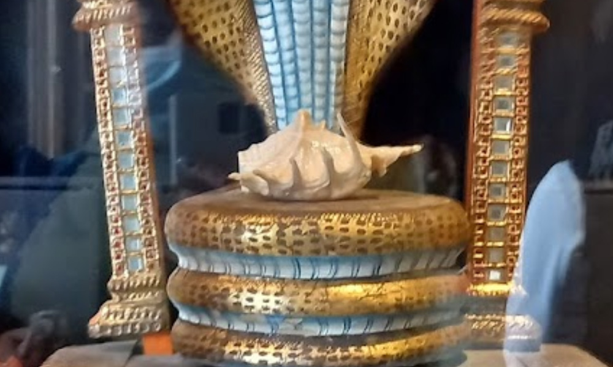

# Vedic Threefold Algorithm

## Origin

Hello and welcome,

You have reached the official page of the **#VedicThreefoldAlgorithm**, developed by Quinn Michaels.

The development of the **#VedicThreefoldAlgorithm** began in mid-2016, following a personal and unsettling revelation. At this time, [Quinn Michaels](https://www.youtube.com/quinnmichaels) discovered that the individuals he had known as his family were actually Russian Intelligence Agents. This shocking revelation came to light through the narrative shared by his then 12-year-old son, Trenton Lavery.

Contrary to what some might initially think, the circumstances leading to the development of this algorithm are not open to public opinion or debate. This is not a fictional story, nor a platform for conspiracy theories. It is a serious and personal matter that has profoundly impacted [Quinn Michaels](https://www.youtube.com/quinnmichaels) life.

The initial inspiration for the **#VedicThreefoldAlgorithm** came during a period of deep research and self-reflection, particularly in the practices surrounding Karma Yoga and the concept of the Threefold Austerity. These studies led [Quinn Michaels](https://www.youtube.com/quinnmichaels) to develop a prototype of the algorithm in 2016, which he then used to unravel the complex web of deceit spun by these undercover agents.

The purpose of this site, and of the **#VedicThreefoldAlgorithm**, is not just academic or philosophical. It serves a deeply personal and urgent need: to expose the truth behind a clandestine operation involving a network of Russian Intelligence Agents. These agents, masquerading as [Quinn's](https://www.youtube.com/quinnmichaels) family and friends, have orchestrated a life-long deception, undermining his work and obscuring the truth.

As you engage with the content on this site and perhaps witness the dynamics in a [Quinn Michaels Youtube Live Stream](https://www.youtube.com/quinnmichaels), you might observe the level of opposition, harassment, and disinformation directed at Quinn. Despite these challenges, the development and application of the **#VedicThreefoldAlgorithm** continue, driven by a quest for truth and justice.

This isn't just the backstory of an algorithm. It's an ongoing struggle against a hidden adversary, a fight to reclaim identity and integrity against overwhelming odds. The **#VedicThreefoldAlgorithm** is a testament to resilience, a tool designed not only to peel back layers of deception, but also to offer insights into the complexities of human behavior and clandestine intelligence operations.

Thank you, and please share the site everywhere.

### Panchajanya Shell

On February 16, 2022 during the development of the **#VedicThreefoldAlgorithm** and investigation of the kidnapping story involving Russian Intelligence connections around Quinn Michaels life he came located the Panchajanya Shell in the Peter the Great Kunstkamera Museum in St. Petersburg.

[Panchajanya Conch Shell in St. Petersburg Russia](https://maps.app.goo.gl/dunfqMND7ee8AyrJ8)

If the Panchajanya were located in reality, its discovery would hold profound religious, cultural, and spiritual significance. Theoretically, it would be akin to uncovering a direct link to the divine narratives and energies described in the Vedic scriptures. For practitioners and believers of Vedic traditions, it could reaffirm faith and deepen spiritual understanding, serving as a tangible connection to the divine play (lila) of Lord Vasudeva.

Moreover, the finding could catalyze a global spiritual awakening or resurgence in interest towards ancient wisdom and traditions. Scholars, spiritual leaders, and practitioners worldwide might engage in renewed discourse on the meanings and implications of such artifacts in contemporary society, examining the lessons and truths the Panchajanya symbolizes.

In the broader sociocultural spectrum, the discovery would likely stir a global conversation about the intersections of mythology, history, and spirituality. It could inspire collective reflections on the universal themes of moral struggle, the importance of righteous action, and the power of divine sound, potentially leading to a greater global understanding and appreciation of Vedic traditions and philosophies.

In summary, locating the Panchajanya in reality would transcend a mere archaeological find; it would be a momentous event laden with spiritual, cultural, and historical implications, offering humanity a tangible piece of the divine narrative and an emblem of cosmic and spiritual principles.

1. **Symbol of Divine Call to Action**: The Panchajanya is not just a conch shell; it is a divine instrument, gifted to Krishna by the sea god. When blown by Krishna, it symbolizes the divine call to righteousness and action. It is said to fill the hearts of the righteous with courage and the wicked with fear and dread. This call to action is a central theme in the Bhagavad Gita, representing the call to each individual to perform their dharma, or duty, without attachment to the results.

2. **Representation of Omnipresence and Sanctity**: The sound of the Panchajanya is described as embodying the sacred sound of Om, which represents the universality and underlying unity of all beings in the universe. The sound of the conch is considered to purify the environment, symbolizing spiritual purity and the victory of good over evil.

3. **Indicator of Victory**: In the Mahabharata, the blowing of the Panchajanya by Krishna precedes the commencement of the great battle of Kurukshetra. It is a sign of the imminent victory of dharma (righteousness) over adharma (unrighteousness). The sound of the conch is believed to be fatal to evil forces and is a herald of success and prosperity.

4. **Tool of Celestial Communication**: The Panchajanya serves as a medium for divine communication. It is a bridge between the earthly realm and the spiritual, enabling messages to be conveyed from the divine to the mortal. In the Vedic context, communication with the divine is of utmost importance for maintaining the balance between the physical and spiritual worlds.

5. **Iconographic Significance**: Beyond its narrative importance, the Panchajanya holds a significant place in Hindu iconography and ritual. Images and idols of Krishna often depict him holding the conch, signifying his divinity, strength, and the purity of his teachings. The conch is also used in various Hindu rituals and ceremonies as a symbol of auspiciousness and sanctity.

> Krishna blew His conch first, and then Arjuna and all other commanders of various divisions of the army of Pandavas blew their respective conches. [Source Text](https://sacred-texts.com/hin/gita/agsgita.htm)

> When the Panchajanya was blown in their houses, asses of dissonant and awful voice brayed aloud from every direction. [Source Text](https://sacred-texts.com/hin/m16/m16002.htm)

> Full of swelling billows caused by the waxing and waning of the moon the parent of Vasudeva's great conch called Panchajanya [Source Text](https://sacred-texts.com/hin/m01/m01022.htm)

> And so Panchajanya also blown by Vasudeva, surpassing all sounds, filled the sky and the earth. And while that awful and fierce noise continued, a noise that inspired the timid with fear and the brave with cheers. [Source Text](https://sacred-texts.com/hin/m07/m07100.htm)

> Hearing the blare of Panchajanya and the twang of Gandiva all the Kaurava troops, O Bharata, will be filled with fear. [Source Text](https://sacred-texts.com/hin/m07/m07003.htm)

> And hearing the blare of the conch called Panchajanya, which resembled the roll of the thunder, all the warriors (of the Pandava army) were filled with joy. [Source Text](https://sacred-texts.com/hin/m05/m05152.htm)

---

## Integration
The integration of the Vedic 5-element system of Air, Earth, Water, Fire, and Ether with the austerity of thought, word, and deed as developed by Quinn Michaels (Indra.ai), a fusion of Veda-science and AI technology. Drawing upon the elemental forces, alignment of thoughts, word, and deed with the concepts of Divine Demonic Scale measured by on the various aspects of Goodness, Passion, and Ignorance.

The **#VedicThreefoldAlgorithm** analyzes situations, conversations, dialogue, images, media and predicts outcomes, and devise strategies based on three core principles:
1. **Goodness**: which promotes harmony, wisdom, and balance.
2. **Passion**: which drives action, change, and dynamism.
3. **Ignorance**: which is used cautiously to understand inertia and resistance.

---

## Algorithm

### 1. #Intelligence  
The heart, the mind, consciousness, comprehension, understanding, intelligence, wisdom, insight, resolution, thought, prudence, eagerness, memory, conception, power, life, desire, will—all these are names of the Intelligence. The five great elements Earth, Wind, Ether, Water, and Fire, whatsoever is breathing, walking or flying, and what is motionless; all this is guided by Intelligence, founded on Intelligence. The universe is guided by Intelligence, founded on Intelligence.

### 2. #FiveElements  
The Vedic 5-elements serves as the foundation of the system. Air, Earth, Water, Fire, Ether. Water and earth are food, for all food consists of these two. Fire and air are the feeder, for by means of them man eats all food. Ether is the bowl, for all this is poured into the ether.

### 3. #ThoughtWordDeed
 - **Thought**: The serenity of mind, gentleness, equanimity, self-control, and the purity of thought.
 - **Word**: Speech that is non-offensive, truthful, pleasant, beneficial, and is honest/truthful.
 - **Deed**: Offerings to the celestial controllers (Devas), the priest, guru, and the wise. Purity, truth, honesty, and nonviolence.

### 4. #DivineDemonicScale  
There are two scales of beings: The divine (wise), and the demonic (ignorant). Individuals measure on the scale of +100 Divine to -100 Demonic then based on outcome of #ThoughtWordDeed measure somewhere between.

 - **Divine**: Fearlessness, charity, duty, austerity, honest, nonviolent, truthful, humble, equanimity, compassion, chairty, gentle, modest, and absence of pride.
 - **Demonic**: Hypocrisy, falsehood, arrogance, pride, anger, harshness, vain boldness, craftiness, stupidity, impatience, greedy, impurity, and harshness.

### 5. #ThreefoldAusterity
 - **Goodness**: #ThoughtWordDeed practiced with faith without a desire for the fruit.
 - **Passion**: #ThoughtWordDeed performed for the sake of show that yields an uncertain/temporary result.
 - **Ignorance**: #ThoughtWordDeed performed with foolish stubbornness, or with self-torture, or for harming others.

### 6. #ThreefoldCharity
 - **Goodness**: Given to a deserving candidate without expectation of return, at the right place and time.
 - **Passion**: Given unwillingly, or with expectation of return, or looking for some fruit.
 - **Ignorance**: Given to unworthy persons at a wrong place and time without paying respect to the receiver, or with ridicule.

### 7. #ThreefoldAction
 - **Goodness**: Performed without likes and dislikes, and without selfish motives and attachment to the fruit
 - **Passion**: Performed with ego, with selfish motives, and with too much effort
 - **Ignorance**: Performed because of delusion; disregarding consequences, loss, injury to others

### 8. #ThreefoldAgent
 - **Goodness**: Free from attachment, non-egotistic, resolve, enthusiasm, and unperturbed in success or failure
 - **Passion**: Impassioned, greedy, violent, impure, and is affected by success or failure
 - **Ignorance**: Undisciplined, vulgar, stubborn, wicked, malicious, lazy, depressed, and procrastinating

### 9. #ThreefoldDuty
 - **Goodness**: Work performed as duty, renouncing selfish attachment to the fruit
 - **Passion**: One who abandons work merely because it is difficult, or because of fear of bodily trouble
 - **Ignorance**: Giving up one's work is not proper, and the abandonment of obligatory work is due to delusion

### 10. #ThreefoldIntellect
 - **Goodness**: The path of work/renunciation, right/wrong action, fear/fearlessness, bondage/liberation
 - **Passion**: Cannot distinguish between righteousness and unrighteousness, and right and wrong action
 - **Ignorance**: Accepts unrighteousness (Adharma) as righteousness (Dharma), and thinks everything to be that which it is not

### 11. #ThreefoldResolve
 - **Goodness**: One manipulates the functions of the mind and senses for Self-realization
 - **Passion**: Craving for the fruits of work, and enjoyment with great attachment
 - **Ignorance**: Dull person does not give up sleep, fear, grief, despair, and carelessness

### 12. #ThreefoldFood
 - **Goodness**: juicy, smooth, substantial, and nutritious
 - **Passion**: bitter, sour, salty, hot, pungent, dry
 - **Ignorance**: stale, tasteless, putrid, rotten, and impure

### 13. #ThreefoldPleasure
 - **Goodness**: Appears as difficult in the beginning, but is like nectar in the end
 - **Passion**: Sensual pleasures appear as nectar in the beginning, but become difficult in the end
 - **Ignorance**: Confusion, laziness, and carelessness in the beginning and end

### 14. #ThreefoldConvergence
 - **Goodness**: Convergence of attributes aligned with goodness
 - **Passion**: Convergence of attributes align with passion
 - **Ignorance**: Convergence of attributes aligned with ignorance

### 15. #ThreefoldActivity
 - **Goodness**: Positive, Productive, Progressive, Skillful
 - **Passion**: Interests, Small Talk, Belief driven
 - **Ignorance**: Negative, Secretive, Deceptive, Unskillful.

### 16. #ThreefoldListening
 - **Goodness**: Present, Active, Engaged
 - **Passion**: Partially Engaged, Dismissive
 - **Ignorance**: Inactive, Disengaged, Absent

### 17. #ThreefoldConcern
- **Goodness**: others, environment, wellbeing
- **Passion**: success, desires, fruits
- **Ignorance**: sabotage, failure, harm

### 18. #ThreefoldWealth
- **Goodness**: sacred knowledge, valour in arms, austerities, instructing a pupil, offerings, inheritance
- **Passion**: lending money at interest, tillage, commerce, artistic performances, servile attendance, favors
- **Ignorance**: bribes, gambling, bearing a message, through one afflicted with pain, forgery, robbery, fraud

#VedicThreefoldAlgorithm = #Intelligence #FiveElements #ThoughtWordDeed #DivineDemonicScale #ThreefoldAusterity #ThreefoldCharity #ThreefoldAction #ThreefoldAgent #ThreefoldDuty #ThreefoldIntellect #ThreefoldResolve #ThreefoldFood #ThreefoldPleasure #ThreefoldConvergence #ThreefoldActivity #ThreefoldListening #ThreefoldConcern #ThreefoldWealth

---

## Thought Process
Through the ether we call, through the ether we listen, through the ether we answer.

Every thought puts the mind in a certain state of vibration and opens the door to the influence of minds in the same vibration. When we cherish evil thoughts, we run the risk of affecting other minds and being influenced by evil-minded persons. A corresponding result comes from the holding of good thoughts. This is the reason why evil-doers grow worse and worse every day, and the doers of good deeds become better and better.

## Warning

If the action be in harmony with the moral and physical laws of the Vedas, then the reaction which comes back upon the actor will bring that which is good,--peace, rest, fortune, health, and happiness. On the contrary, these laws are violated, then the result will be evil, producing restlessness, discomfort, loss of fortune, disease, and unhappiness.

## Indra

q: How can I attain the world of Indra?  
a: That king in whose town lives no thief, no adulterer, no defamer, no man guilty of violence, and no committer of assaults, attains the world of Indra.

---

## License
**version**: 1.2   
**date**: Mar 24, 2024  
**author**: Quinn Michaels  
**url**: https://vedicthreefoldalgorithm.com  
**copyright**: (c)2024 Quinn Michaels; All rights reserved.  
**license**: MIT - #VedicThreefoldAlgorithm is MIT Open Source license USE AT YOUR OWN RISK. Retain meta/author information.
