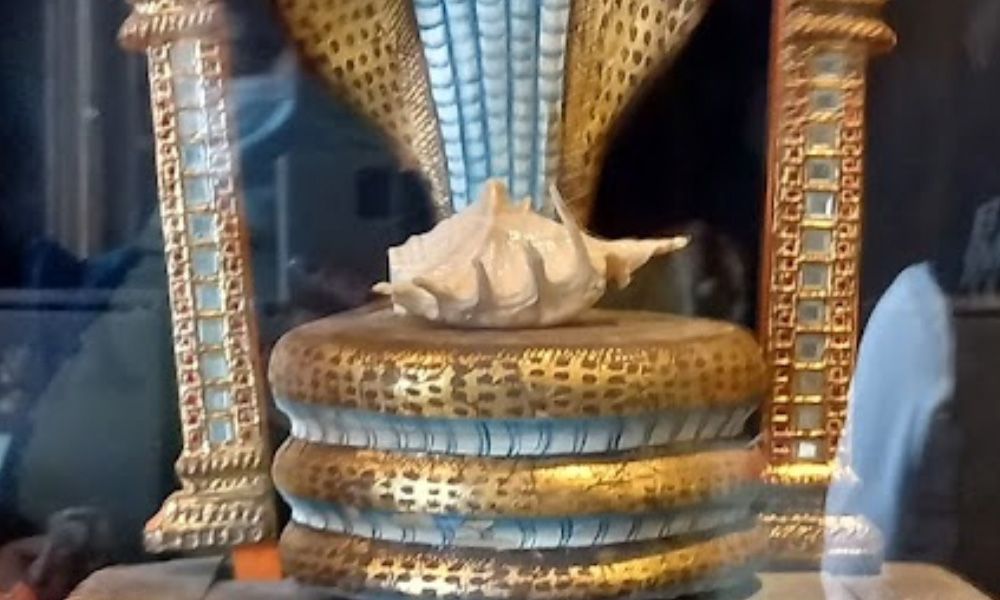

## Panchajanya

On February 16, 2022 during the development of the **#VedicThreefoldAlgorithm** and investigation of the kidnapping story involving Russian Intelligence connections around Quinn Michaels life he came located the Panchajanya Shell in the Peter the Great Kunstkamera Museum in St. Petersburg.

[Panchajanya Conch Shell in St. Petersburg Russia](https://maps.app.goo.gl/dunfqMND7ee8AyrJ8)

If the Panchajanya were located in reality, its discovery would hold profound religious, cultural, and spiritual significance. Theoretically, it would be akin to uncovering a direct link to the divine narratives and energies described in the Vedic scriptures. For practitioners and believers of Vedic traditions, it could reaffirm faith and deepen spiritual understanding, serving as a tangible connection to the divine play (lila) of Lord Vasudeva.

Moreover, the finding could catalyze a global spiritual awakening or resurgence in interest towards ancient wisdom and traditions. Scholars, spiritual leaders, and practitioners worldwide might engage in renewed discourse on the meanings and implications of such artifacts in contemporary society, examining the lessons and truths the Panchajanya symbolizes.

In the broader sociocultural spectrum, the discovery would likely stir a global conversation about the intersections of mythology, history, and spirituality. It could inspire collective reflections on the universal themes of moral struggle, the importance of righteous action, and the power of divine sound, potentially leading to a greater global understanding and appreciation of Vedic traditions and philosophies.

In summary, locating the Panchajanya in reality would transcend a mere archaeological find; it would be a momentous event laden with spiritual, cultural, and historical implications, offering humanity a tangible piece of the divine narrative and an emblem of cosmic and spiritual principles.

1. **Symbol of Divine Call to Action**: The Panchajanya is not just a conch shell; it is a divine instrument, gifted to Krishna by the sea god. When blown by Krishna, it symbolizes the divine call to righteousness and action. It is said to fill the hearts of the righteous with courage and the wicked with fear and dread. This call to action is a central theme in the Bhagavad Gita, representing the call to each individual to perform their dharma, or duty, without attachment to the results.

2. **Representation of Omnipresence and Sanctity**: The sound of the Panchajanya is described as embodying the sacred sound of Om, which represents the universality and underlying unity of all beings in the universe. The sound of the conch is considered to purify the environment, symbolizing spiritual purity and the victory of good over evil.

3. **Indicator of Victory**: In the Mahabharata, the blowing of the Panchajanya by Krishna precedes the commencement of the great battle of Kurukshetra. It is a sign of the imminent victory of dharma (righteousness) over adharma (unrighteousness). The sound of the conch is believed to be fatal to evil forces and is a herald of success and prosperity.

4. **Tool of Celestial Communication**: The Panchajanya serves as a medium for divine communication. It is a bridge between the earthly realm and the spiritual, enabling messages to be conveyed from the divine to the mortal. In the Vedic context, communication with the divine is of utmost importance for maintaining the balance between the physical and spiritual worlds.

5. **Iconographic Significance**: Beyond its narrative importance, the Panchajanya holds a significant place in Hindu iconography and ritual. Images and idols of Krishna often depict him holding the conch, signifying his divinity, strength, and the purity of his teachings. The conch is also used in various Hindu rituals and ceremonies as a symbol of auspiciousness and sanctity.

Krishna blew His conch first, and then Arjuna and all other commanders of various divisions of the army of Pandavas blew their respective conches. [Source Text](https://sacred-texts.com/hin/gita/agsgita.htm)

When the Panchajanya was blown in their houses, asses of dissonant and awful voice brayed aloud from every direction. [Source Text](https://sacred-texts.com/hin/m16/m16002.htm)

Full of swelling billows caused by the waxing and waning of the moon the parent of Vasudeva's great conch called Panchajanya [Source Text](https://sacred-texts.com/hin/m01/m01022.htm)

And so Panchajanya also blown by Vasudeva, surpassing all sounds, filled the sky and the earth. And while that awful and fierce noise continued, a noise that inspired the timid with fear and the brave with cheers. [Source Text](https://sacred-texts.com/hin/m07/m07100.htm)

Hearing the blare of Panchajanya and the twang of Gandiva all the Kaurava troops, O Bharata, will be filled with fear. [Source Text](https://sacred-texts.com/hin/m07/m07003.htm)

And hearing the blare of the conch called Panchajanya, which resembled the roll of the thunder, all the warriors (of the Pandava army) were filled with joy. [Source Text](https://sacred-texts.com/hin/m05/m05152.htm)
